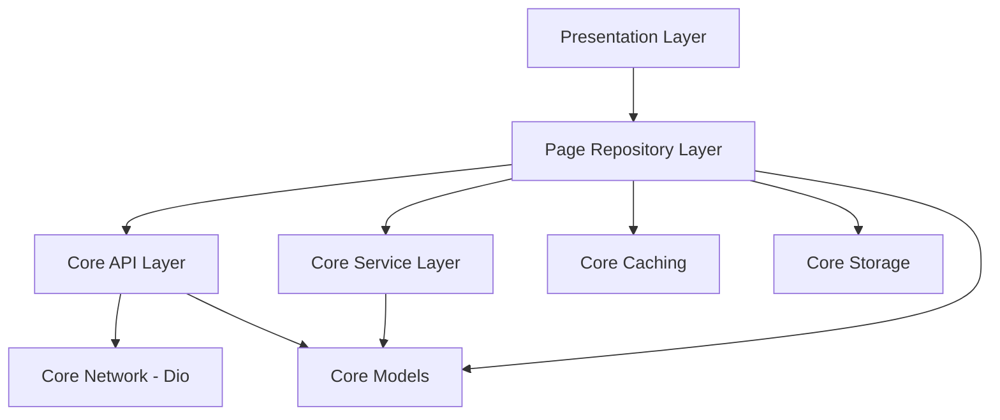

# AI Fitness App Architecture

This document defines the architectural standards for the AI Fitness application. Each page in the application is structured into four distinct layers, a tabs folder, and a page-specific widgets folder.

## Application Core & Routing

The application follows a **Centralized Core** philosophy. All shared logic, data sources, and configurations reside in `lib/core/`.

*   **lib/core/network/**: Shared network configurations, interceptors, and API clients using **Dio**.
*   **lib/core/api/**: Centralized hub for all backend communications.
*   **lib/core/service/**: Centralized business logic, complex calculations, and AI processing.
*   **lib/core/models/**: Shared data structures, including Entities and Data Transfer Objects (DTOs).
*   **lib/core/caching/**: Logic for temporary data retention and cache invalidation.
*   **lib/core/storage/**: Persistent local data storage (e.g., SharedPreferences, Hive, or Secure Storage).
*   **lib/core/theme.dart**: Global design system (colors, typography).
*   **lib/routes.dart**: Centralized routing and navigation.
*   **lib/widgets/**: Common/shared widgets used across multiple pages.

## Page Structure (Layered)

Each page under `lib/page/[page_name]/` is focused on its specific data orchestration and presentation:

1.  **repository/** (previously 'data'): The orchestration layer. **It calls the centralized API and Service layers in `lib/core/`**. It also interacts with `core/caching` and `core/storage`.
2.  **presentation/**: The UI layer. Contains screens and state management (BLoC, Provider, etc.). **It only communicates with the page's Repository layer.**
3.  **widgets/**: UI components **specific to this page**.
4.  **tabs/**: Sub-navigation components (if applicable).

## Interaction Flow

The following flow must be followed for data and logic requests:

1.  **Presentation Layer** requests data from the **Page Repository Layer**.
2.  **Page Repository Layer** coordinates with **Core API**, **Core Service**, **Core Caching**, or **Core Storage**.
3.  Results (mapped to **Models**) are returned to the **Page Repository Layer**.
4.  **Page Repository Layer** provides the processed state back to the **Presentation Layer**.



## Sub-Navigation (Tabs)

Pages that contain sub-views or tabs should have a dedicated folder:

*   **tabs/**: Contains the individual tab screens or components that make up the page's sub-navigation.

## Folder Structure Example

```text
lib/
├── core/
│   ├── api/ (Centralized)
│   ├── service/ (Centralized)
│   ├── models/ (Shared Entities/DTOs)
│   ├── network/ (Dio)
│   ├── caching/
│   ├── storage/
│   └── theme.dart
├── widgets/ (Common/Shared)
├── page/
│   └── [page_name]/
│       ├── repository/ (Orchestrates Core calls)
│       ├── presentation/
│       ├── widgets/ (Page-specific)
│       └── tabs/
└── routes.dart
```
